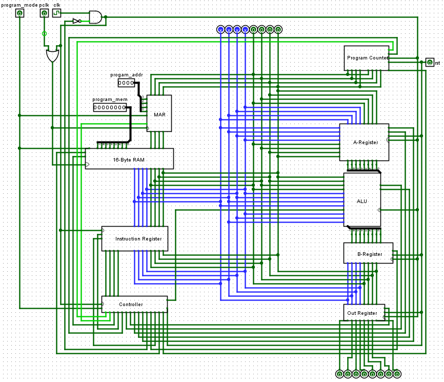
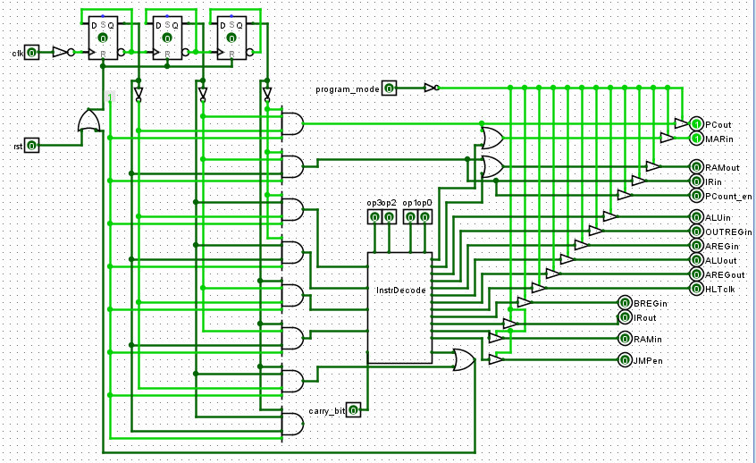

# 8-bit CPU & Assembler
The CPU was built with logic gate simulation software called Logisim-Evolution and the Assembler is built in Python.

This project contains:
* 8-bit CPU with a basic instruction set
* 16 bytes of RAM
* Simple assembler

## Screenshots
Shown below is the 8-bit CPU circuit in Logisim-Evolution. Each of the modules in the image have been made with logic gates.

## Installation and Setup Instructions
Clone this repository. You will need to have Java SE Development Kit installed in order to run Logisim-Evolution. Java SE Development Kit: https://www.oracle.com/java/technologies/javase-jdk13-downloads.html

To open logisim-evolution you will then have to run the 'logisim-evolution.bat' file. Upon opening Logisim-Evolution you can then open the 'CPU_8_bit.circ' file to open the CPU circuit.

## Operation
To use the CPU you will first need to write an assembly program that you wish to run in a .txt file. After writing the .txt file you will then have to run the 'Assembler.py' file to convert the assembly code to machine code. 

Once retrieving the machine code you can now open the 'CPU_8_bit.circ' file and load the machine code into the 16 byte RAM. To load the program into RAM you will have to enable 'program_mode' and then change the 'program_mem' and 'program_addr' inputs to the machine code specified in the file retrieved with the python program. To save the information into memory you will have to clock the 'pclk' one time per instruction.

After loading the program into the 16 byte RAM you can turn off the 'program_mode' and set the 'pclk' to be in a low state. To run the program you can either manual toggle the 'clk' input or go to the 'Simulate' tab in Logisim-Evolution menu bar and check the 'Ticks Enabled' box.

## Assembly Instructions

Legend:
* _D_ is a byte of data
* _A_ is a register that we have in our CPU
* _B_ is a register that we have in our CPU
* _M_ is a memory address. Used to for either the source or destination of a data copy.

#### Data transfer group
| Instruction   | Description                                                |
|---------------|------------------------------------------------------------|
| `LDA M`       | Load the _A_ register with value in memory address _M_     |
| `STA M`       | Store data in _A_ register to memory address _M_           |
| `MOVA D`      | Move the data _D_ into _A_ register                        |

#### Arithmetic group
| Instruction   | Description                   		|
|---------------|---------------------------------------|
| `ADD M`       | _A_ = _A_ + (byte of data in memory)	|
| `SUB M`       | _A_ = _A_ - (byte of data in memory)	|

#### Logical group
| Instruction   | Description                            |
|---------------|----------------------------------------|
| `AND M`       | _A_ = _A_ AND (byte of data in memory) |
| `OR M`       	| _A_ = _A_ OR (byte of data in memory)  |
| `INVB`      	| _B_ = _~B_							 |

#### Branching group
| Instruction   | Description                               |
|---------------|-------------------------------------------|
| `JMP D`       | Jump to address _D_     					|
| `JC D`       	| Jump to address _D_ if carry flag is set  |

#### Machine control
| Instruction   | Description      |
|---------------|------------------|
| `HLT`       	| Halt the CPU     |

#### I/O Group
| Instruction   | Description      																			|
|---------------|-------------------------------------------------------------------------------------------|
| `INA D`      	| Put the content _D_ on to the databus and input it to register _A_						| 
| `OUTA`    	| Put the content in register _A_ on to the databus and receive it in the output register   |

## Reflection
